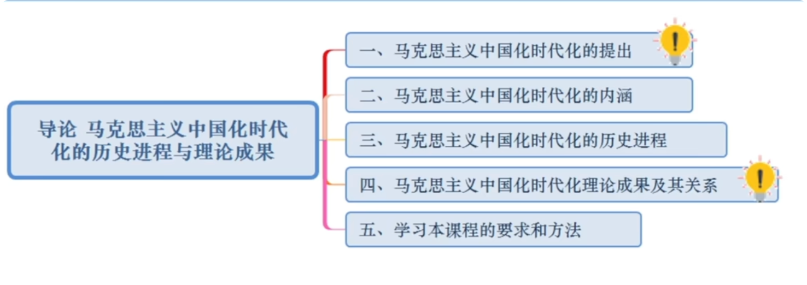
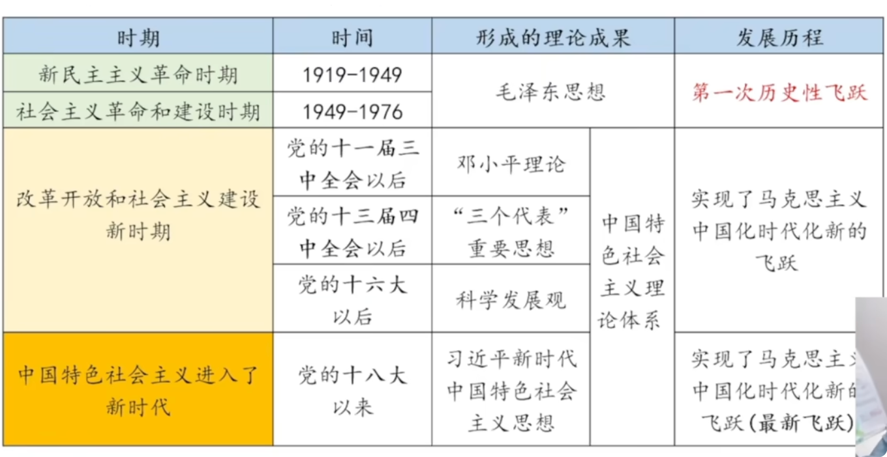
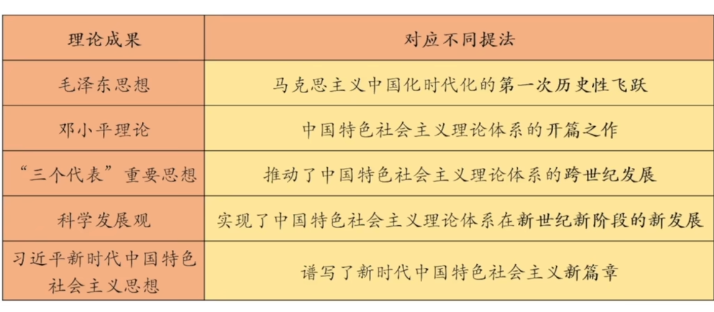

# 导论 马克思主义中国化时代化的历史进程与理论成果

## 一、马克思主义中国化时代化的提出

1. 马克思主义哪来的（when？who？where？what？how？）
1917年，列宁，俄国，发起十月革命，给中国送来了马克思列宁主义。

2. 中国共产党在1921年应运而生  
    开天辟地的体现：【多选】
    + 中国人民和中华民族的前途和命运
    + 近代以后中华民族发展的方向和进程
    + 世界发展的趋势和格局

3. **1938** 毛泽东 **六届六中全会** **通过《论新阶段》** 标志“马克思主义的中国化”正式提出 （老毛66接（阶）替老 马）【单选】

4. 1945年 党的七大 刘少奇 对马克思主义中国化从理论上作了进一步的阐述 指出毛泽东思想是“中国化的马克思主义”

5. 2021年 党的十九届六中全会总结了百年来中国共产党推进马克思主义中国化时代化的重大成就，阐释了马克思主义中国化时代化的重大历史意义 【多选】

6. 2022年，党的二十大 不断谱写马克思主义中国化时代化**新篇章**，继续推进马克思主义中国化时代化的新要求。

7. **推进马克思主义中国化时代化是马克思主义理论本身发展的内在要求；是解决中国实际问题的客观需要**。（必然性，原因）【多选】

## 二、马克思主义中国化时代化的内涵

1. *坚持把马克思主义基本原理同中国具体实际相结合、同中华优秀传统文化相结合（途径/方法/手段，客观单选多选）

2. *马克思主义中国化时代化的科学内涵，包含三层意思 【简答】
（1）运用马克思主义的立场、观点和方法，观察时代、把握时代、引领时代，解决中国革命、建设、改革中的问题。
（2）总结和提炼中国革命、建设、改革的实践经验将其上升为理论，不断丰富和发展马克思主义的理论宝库，赋予马克思主义以新的时代内涵。
（3）运用中国人民喜闻乐见的民族语言来阐述马克思主义，使其根植于中华优秀传统文化的土壤之中，具有中国特色、中国风俗、中国气派。

## 三、 马克思主义中国化时代化的历史进程

1. 新民主义革命时期，开辟了**农村包围城市、武装夺取政权**的正确革命道路 创立了**毛泽东思想**。

2. 在社会主义**革命**和**建设**时期，**第二次结合**，毛泽东思想是马克思主义中国化时代化的**第一次历史性飞跃**。【单选】

3. 1978年 **十一届三中全会**，开启了**改革开放**和**社会主义现代化建设历史新时期**，以**邓小平**为主，围绕**什么是社会主义、怎样建设社会主义**这一根本问题，创立了**邓小平理论**。【单选】

4. 党的**十三届四中全会**以后，以江泽民为主，加深了对**什么是社会主义、怎样建设社会主义和建设什么样的党，怎样建设党**的认识，**形成了“三个代表”重要思想**。

5. 新世纪新阶段 2002，**党的十六大** 胡锦涛 深刻认识和回答了新形势下实现**什么样的发展、怎样发展**等重大问题，形成了**科学发展观**。

6. **党的十八大以来**，习近平，**习近平新时代中国特色社会主义思想**，实现了**马克思主义中国化时代化新的飞跃**。

## 四、马克思主义中国化时代化理论成果及其关系

1. *毛泽东思想，是马克思列宁主义在中国的运用和发展，是被实践证明了的关于中国革命和建设的正确理论原则和经验总结，是中国共产党集体智慧的结晶。（毛泽东思想 == 毛泽东的思想？）【辨析】

2. **党的十七大**首次提出了“中国特色社会主义理论体系”的科学概念。 【单选】

3. 马克思主义中国化时代化理论成果及其提法

4. 马克思主义中国化时代化理论成果及其关系：【简答】
1）马克思主义中国化时代化的理论成果是**一脉相承又与时俱进**的关系。
（总）
2） 毛泽东思想所蕴含的马克思主义的立场、观点和方法，为中国特色社会主义理论体系提供了基本遵循。（分）
3） 中国特色社会主义理论体系在新的历史条件下进一步丰富和发展了毛泽东思想。（分）
4）**毛泽东思想和中国特色社会主义理论体系，都是马克思列宁主义在中国的运用和发展，都以独创性的理论成果丰富和发展了马克思主义的理论宝库，都是党和国家必须长期坚持的指导思想，是全国各族人民团结奋斗的共同思想基础**。【单】（相同点）

## 五、 学习本课程的要求和方法

    + 马克思主义是我们认识世界、把握规律、追求真理、改造世界的强大思想武器。
    + 它是科学的理论、人民的理论、实踐的理论、不断发展的开放的理论，自诞生以朱就始终占据着真理和道义的制高点。
    + 马克思主义不仅深**刻改变了世界**，也**深刻改变了中国**。

1. 本教程以马克思主义中国化时代化为主线。【单选】
2. 用好本教材、学好本课程，我们要把握好以下几点：
    1）一是掌握基本理论。
    2）二是培养理论思维。
    3）三是坚持理论联系实际。
